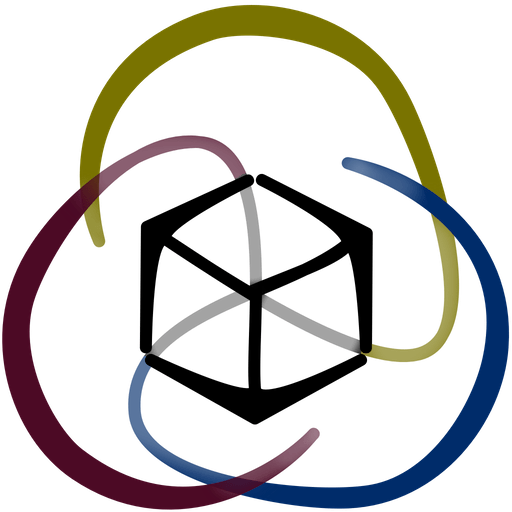

# Note of intent

## **Ensuring free, fair and sustainable use of software tools contributing to the Common Good.**

This [white paper](https://en.wikipedia.org/wiki/White\_paper) aims at increasing the quantity and viability of digital services operated as commons, that is, as resources shared and exploited in a sustainable way by a community.

To do so, it **clarifies the vocabulary**, describes the **minimal constraints** without which digital resources can never reach the status of commons, and proposes **concrete guidelines** to make their development easier.

This document describes the main categories of mutual commitments and required behaviours that ensure the free, fair and sustainable use of digital services benefiting the general interest, especially when these services are co-produced by public actors. Beyond these categories, it offers good practices to build real commons wherein users are at the heart of the decisions.

## Target audience

The target audience is primarily "innovators\[^1]" \[Rogers, 1962] who have the opportunity and intention to organise the commons. The aim is to help them confirm their intuitions, communicate with a clear and referenceable vocabulary, and convince their peers. By this I mean that if you already have experience in operating commons, you or your organisation will probably have specific practices that are more appropriate to your context. The recommendations provided here are good practices to avoid the usual pitfalls that come with an open strategy based on good intentions but failing at implementation; it is not the only way to bring about commons.

All types of structures are involved in these issues, from large companies to individuals, from non-profits to government agencies. A subset of these recommendations is specifically aimed at public actors, which are subject to more constraints than others and yet possess the largest pool of existing services that could be shared.

\[^1]: As defined by the [innovation adoption curve](https://www.lescahiersdelinnovation.com/la-courbe-de-diffusion-de-l-innovation-selon-roger/), that is, the 2% who take a risk to adopt a new behaviour within an organisation.
